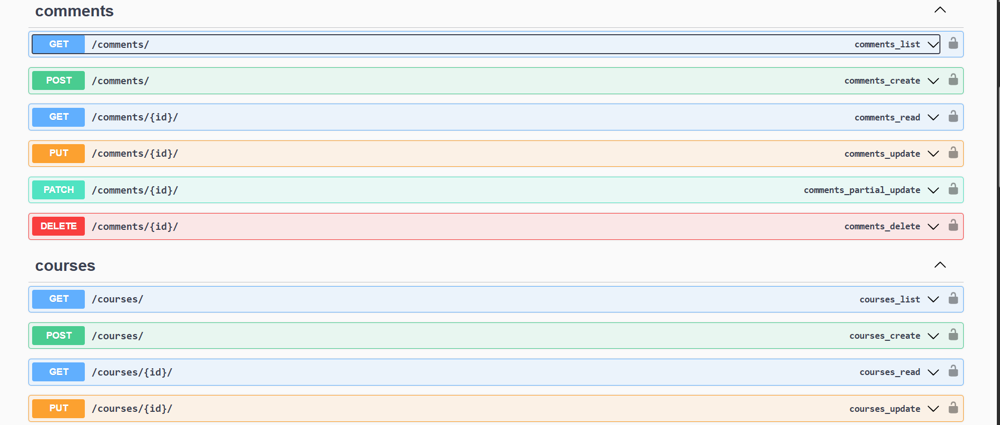
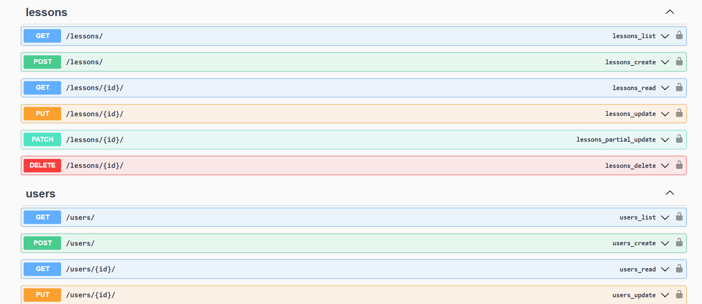
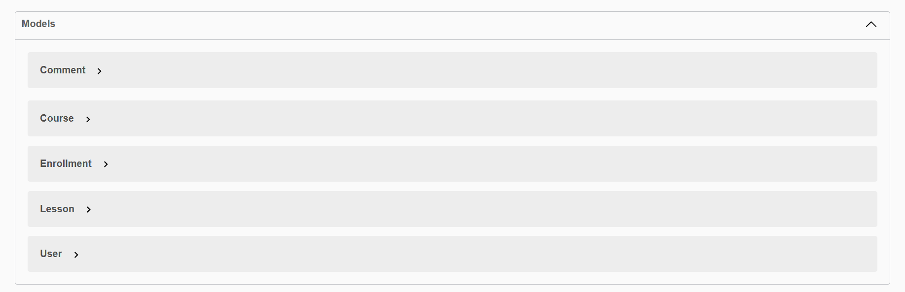

# Instrucciones para levantar el servicio

Tras clonar el repositorio: docker compose up

Acceder al contenedor web y ejecutar:
- python manage.py makemigrations
- python manage.py migrate
- python manage.py createsuperuser

Inciar sesion como admin en localhost:8500:
- Sites > Add Site
  - localhost:8500 
- Social Applications > Add Social Application
  - ID: 1
  - Name: Google Auth
  - Client ID: <Google Secret>
  - Secret Key: <Google Secret>
  - Sites: Choose all sites

# Descripción general del proyecto.

API de cursos en línea construida con Django y Django REST Framework sobre PostgreSQL. Expone recursos de la app courses_api vía ViewSets con filtros, búsquedas, ordenación y paginación estándar de DRF. La autenticación soporta sesiones y tokens, y el inicio de sesión social se gestiona con django-allauth (Google OAuth). La documentación interactiva se publica con drf-yasg en /swagger/ y /redoc/.

# Ejemplo de endpoints o screenshots de Swagger.

localhost:8500/swagger

